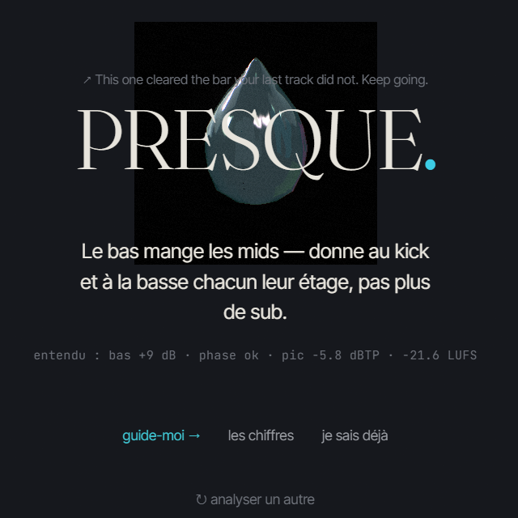
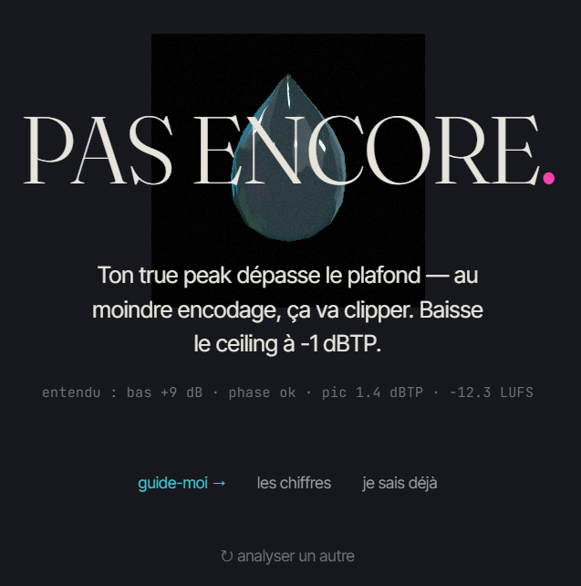

<h1 align="center">CuePoint</h1>

<p align="center">
  <b>The track is <i>almost</i> there. Something's off — and you can't name it.</b><br>
  Drop it here instead of opening ten tabs. Get back <i>one</i> honest fix, then the exact plugin chain.
</p>

<p align="center">
  A real DSP listens to your bounce <b>entirely in the browser</b> — LUFS, true peak, phase, spectrum — and Cue<br>
  names the single priority move in plain producer French. No upload. No bluffing. Free.
</p>

<p align="center">
  <a href="https://cuepoint-mu.vercel.app"></a>
</p>

<p align="center">
  
  
  
  
  
  
</p>

<p align="center">
  <a href="https://cuepoint-mu.vercel.app"><b>→ Open the live app</b></a> ·
  <a href="https://github.com/arochab/cuepoint">Source</a>
</p>

<p align="center">
  
</p>

---

Every producer knows the moment: the mix is *close*, something is off, and the not-knowing is what kills the night. CuePoint refuses to add to the noise. You drop a track, a real DSP runs in your browser, and Cue tells you the **one** thing to fix first — in the voice of a producer who's been there — then hands you the chain. French by default, EN on a toggle.

**The rule baked into all of it: Cue can't bluff.** Six things it genuinely measures map to five producer needs, and a fix is offered *only* when a measurement supports it — the routing is structural, not a vibe. Under every verdict sits an **honesty receipt** with the raw numbers Cue actually heard.

<p align="center">
  
  &nbsp;
  
</p>
<p align="center"><sub><b>PRESQUE</b> — almost there, here's the one move &nbsp;·&nbsp; <b>PAS ENCORE</b> — not yet, here's why</sub></p>

## Proof, not vibes

Most "AI mix assistants" upload your file and improvise advice. CuePoint does the opposite — and every claim below is a clickable file, not a slogan.

| Cue hears | The real measurement | Where |
|---|---|---|
| **Loudness** | ITU-R **BS.1770-4** integrated LUFS — K-weighting, 400 ms blocks @ 100 ms hop, two-stage gating | [`audio.ts`](src/lib/utils/audio.ts) |
| **Headroom** | **4×-oversampled Lanczos** true peak (dBTP) — inter-sample, not sample peak | [`audio.ts`](src/lib/utils/audio.ts) |
| **Spectrum** | **Welch-averaged 1/3-octave** spectrum (Hann) on a hand-written **radix-2 FFT** | [`audio.ts`](src/lib/utils/audio.ts) |
| **Balance** | **regression-fit** spectral tilt | [`audio.ts`](src/lib/utils/audio.ts) |
| **Phase** | whole-file **Pearson** phase correlation | [`audio.ts`](src/lib/utils/audio.ts) |
| **Motion** | a 96-bucket **RMS envelope** (replayed on the verdict reveal) | [`audio.ts`](src/lib/utils/audio.ts) |
| **Zero upload** | all of the above runs in an `OfflineAudioContext` — your unreleased music never touches a server | — |
| **Can't bluff** | 6 issue types → 5 needs; recipes route off an explicit `recipe.need` field, no overlap scoring | [`needRoutes.ts`](src/lib/reco/needRoutes.ts) |

## How it works

```
  your .wav/.mp3  ──►  OfflineAudioContext (decode, in-browser)
        │
        ▼  src/lib/utils/audio.ts   (100% client-side · nothing uploaded)
  ┌──────────────────────────────────────────────────────────┐
  │ BS.1770-4 LUFS · 4× true peak · Pearson phase             │
  │ Welch 1/3-oct FFT · spectral tilt · RMS envelope          │
  └──────────────────────────────────────────────────────────┘
        │  metrics → one priority need   (score.ts · genre-aware)
        ▼
   needRoutes.ts  ──►  the matching plugin-chain recipe
   (low-end · phase · top-end · loudness · ready?)   (deterministic · no bluff)
```

1. **The browser is the only machine.** `analyzeAudio()` decodes into an `OfflineAudioContext` and runs the full DSP locally, yielding a stage callback that drives an *honest* 4-step progress bar (decode → loudness → true peak → spectrum). It reaches 100% only when the result is truly ready — the faked "95%-then-snap" timer was deleted on purpose.
2. **Metrics become needs, not guesses.** Raw numbers are read genre-aware into a verdict and a single priority issue — so "too loud" or "low end's too heavy" means *for this style*.
3. **Needs route to recipes structurally.** `suggestionsForIssues()` filters the **20 recipes** by their explicit `need`, returning only routes the DSP can back. Each is a real chain (e.g. FabFilter Pro-Q 3 → Pro-C 2 → D16 Devastor 2 → Pro-L 2) with an Ableton-native alternative.

Tuned for the music it serves — deep house, minimal, techno, dub techno, electro, acid, UK garage and ambient — each with its own target zones.

## Built agentically with Claude Code — the honest version

This was built with Claude Code using heavy multi-agent workflows, used **adversarially**. That process is the portfolio — told straight, including the part where an agent was wrong.

- **The UX was put on trial, not vibe-coded.** Ruthless multi-agent "juries" (Jobs / Ive / Musk lenses, a mastering engineer, a localization expert) audited the *real running app*. A creator → tester → hard-judge loop generated **4 radical zero-card directions** and a hard judge picked the winner — **"Silence."** The verdict was never "add features" — it was **delete**: the mix-score hero, stat tiles, euro packs and a div-heavy screen all went.
- **An agent hallucinated — verification caught it.** A workflow confidently described a scene architecture that *did not exist* in the codebase. Checking the claim against the real file tree exposed it; the output was discarded. Agents are used adversarially and **verified against real code, never trusted blindly.**
- **Honesty became an engineering rule.** A `Math.random()` "live meter" and a fake completion delay were found and **deleted**. The anti-bluff `recipe.need` routing exists *because* a jury demanded Cue never promise a fix the measurement can't back.

Same body of work as the author's other public repos: [claude-eats-tokens](https://github.com/arochab/claude-eats-tokens), kapman-news, prism, brandpulse-app.

## Design — "Silence"

Not a theme on top of an app; the app *is* the design.

- **One room, zero cards.** A dark single-column space — Slate `#16181D` ground, Mist text — with one accent: Tide cyan `#36C9D6`. `radius: 0`, `shadow: 0`, one easing curve. A `:where(...)` reset strips background, border, shadow, radius and padding off every legacy card class, so cards can't creep back in.
- **Type as voice.** Fraunces serif speaks the verdicts; Inter Tight runs the UI; JetBrains Mono is reserved strictly for plugin/param strings.
- **Colour means something.** It lives in exactly one place — the droplet — so a verdict hue carries weight: cyan `#36C9D6` = one fix, lime `#C9F23C` = ship it, magenta `#F73CB0` = needs work. "Cue" is a real Three.js liquid-glass object: a GLSL simplex-noise **vertex-displacement** shader + Fresnel rim + bloom, pulsing to your track's **real RMS envelope** (never `Math.random()`). `prefers-reduced-motion` skips WebGL for a static, on-brand fallback.

## Tech stack

**Svelte 5** runes (module state in `.svelte.ts`, exported `$state` mutated in place) · **Vite 6** · **Tailwind v4** (`@theme`, no config file) · **TypeScript 5** strict — `svelte-check`: **0 errors** · **Three.js** custom shader via `onBeforeCompile`, lazy chunk **~952 KB** so first paint stays light (index **~342 KB**) · **Supabase** Google + email-link auth, RLS-gated track *memory* (derived numbers only, never audio) · **Vercel** static SPA · **i18n** FR default + EN.

## Run it locally

```bash
git clone https://github.com/arochab/cuepoint.git
cd cuepoint
npm install

# Supabase is OPTIONAL — the analyzer works fully signed-out.
# Fill these in only for Google / email-link auth + saved track memory.
cp .env.example .env
#   VITE_SUPABASE_URL=https://your-project.supabase.co
#   VITE_SUPABASE_KEY=sb_publishable_xxxxxxxx   (legacy VITE_SUPABASE_ANON_KEY also works)

npm run dev      # → http://localhost:5173
npm run build    # → dist/  (Vercel: framework "vite", output "dist")
npm run check    # svelte-check (TypeScript)
```

The DSP, the droplet and the verdict all work with **no `.env` at all** — Supabase only adds saved track memory.

## Repo map

```
src/lib/utils/audio.ts        the DSP — FFT, BS.1770-4 LUFS, 4× true peak, spectrum, RMS envelope
src/lib/reco/score.ts         metrics → verdict + genre-aware band reads
src/lib/reco/needRoutes.ts    deterministic need → recipe routing (the anti-bluff layer)
src/lib/reco/issueText.ts     producer-voice FR/EN verdict copy + honesty receipt
src/lib/data/recipes.ts       20 plugin-chain recipes (+ Ableton-native alternatives)
src/lib/cue/cueScene.ts       the Three.js liquid-glass droplet (real shader + RMS reactivity)
src/lib/i18n/index.svelte.ts  FR-default bilingual dictionary (runes module state)
src/App.svelte                in-memory router (Home · Analyzer · Projects · Auth · Admin)
vercel.json                   SPA rewrite + immutable asset caching
```

## License

[MIT](LICENSE) · Built by [Adam Chabbi](https://github.com/arochab) (@arochab).
